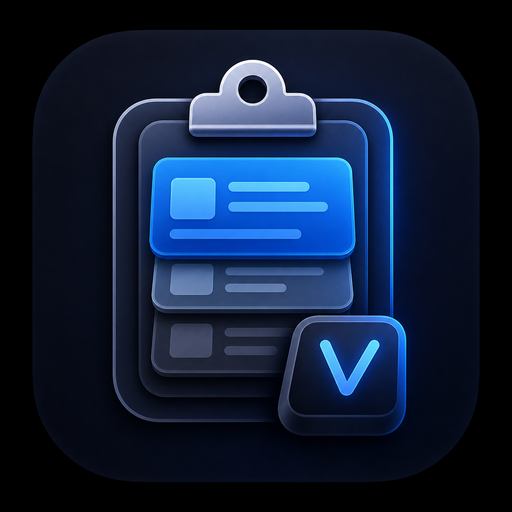

# Clipboard for Linux

A Windows-inspired clipboard history popup for Ubuntu/Linux, built with C++ and Qt 6.

Press `Ctrl + Alt + V`, browse recent clipboard items, restore one with the keyboard or mouse, and keep important items pinned at the top.

## Features

- Windows-style popup with search, keyboard navigation, mouse support, tray menu, and draggable position
- Text-focused clipboard history
  - Plain text
  - Code snippets and terminal output
  - Rich text / HTML converted to plain text
  - Files and images are ignored intentionally
- Real pinned items
  - Pinned items stay at the top
  - Pinned items survive restarts
  - Clear history only removes unpinned items
- Configurable history behavior
  - Session-only history by default
  - Optional persistent unpinned history
  - Configurable history limit
  - Clear-confirmation toggle
- Environment-aware behavior
  - On Linux/X11, the app listens for the global shortcut directly
  - On X11 with `xdotool`, `Enter` restores and pastes directly
  - On Wayland, `Enter` restores the clipboard item and tells you to paste with `Ctrl+V`
- Settings dialog for
  - Persistence
  - History size
  - Autostart
  - Global shortcut editing on Linux

## Shortcut

Default shortcut:

```text
Ctrl + Alt + V
```

## Install

```bash
git clone https://github.com/YOUR_USERNAME/YOUR_REPOSITORY.git
cd YOUR_REPOSITORY
bash install.sh
```

`install.sh` does the rest:

- Installs Ubuntu dependencies automatically when `apt` is available
- Builds the app in release mode
- Installs the binary, desktop entry, and icons under `/usr/local`
- Creates the user autostart entry
- Tries to install the GNOME shortcut extension
- Starts the app in the background

Useful options:

```bash
bash install.sh --skip-deps
bash install.sh --no-start
bash install.sh --prefix /opt/ubuntu-clip-win
```

## Uninstall

```bash
bash uninstall.sh
```

By default, uninstall removes the installed files, autostart entry, GNOME extension, user settings, and clipboard database.

Useful options:

```bash
bash uninstall.sh --keep-data
bash uninstall.sh --prefix /opt/ubuntu-clip-win
```

## Requirements

If you prefer manual dependency installation instead of automatic install:

```bash
sudo apt update
sudo apt install -y \
  build-essential \
  cmake \
  qt6-base-dev \
  libqt6sql6-sqlite \
  qt6-qpa-plugins \
  wl-clipboard \
  xdotool \
  libglib2.0-bin \
  gnome-shell-extension-prefs
```

`wl-clipboard` is recommended on Wayland so the app can fall back to `wl-paste` if Qt reports a clipboard change before the text payload is readable.
`xdotool` is optional on Wayland, but it is required for one-key paste on X11.

## Run

```bash
ubuntu-clip-win --show
ubuntu-clip-win --background
ubuntu-clip-win --settings
```

## Usage

1. Copy text from any app. Rich text is stored as plain text.
2. Press `Ctrl + Alt + V`.
3. Use `Up` / `Down` to choose an item.
4. Press `Enter`.

Behavior depends on the session:

- X11 with `xdotool`: the item is restored and pasted automatically.
- Wayland or X11 without `xdotool`: the item is restored to the clipboard, then you paste it in the target app with `Ctrl+V`.

Useful shortcuts inside the popup:

- `Ctrl+F`: focus search
- `Ctrl+C`: copy the selected history item without auto-paste
- `Ctrl+P`: pin or unpin the selected item
- `Delete`: delete the selected item
- `Ctrl+Delete`: clear unpinned history
- `Ctrl+,`: open settings

## Storage Model

- Unpinned history is session-only by default
- You can enable persistent unpinned history in Settings
- Pinned items are always preserved across restarts
- History size is configurable in Settings

Clipboard data is stored locally in the app data directory so pinned items and optional persistent history can survive restarts.
Only text history is stored in this build. Files and images are ignored.

## GNOME Shortcut

The repository includes a GNOME Shell extension that binds `Ctrl + Alt + V` for Wayland sessions.

Manual install:

```bash
./gnome-extension/install.sh
```

If the shortcut does not work immediately on Wayland, log out and log back in.

## Build from Source

```bash
cmake -S . -B build -DCMAKE_BUILD_TYPE=Release -DCMAKE_INSTALL_PREFIX=/usr/local
cmake --build build -j"$(nproc)"
sudo cmake --install build
```

## Notes About Wayland and X11

- Linux/X11 uses the app's built-in global shortcut listener
- GNOME/Wayland uses the extension for the global shortcut
- X11 can use `xdotool` for automatic paste
- Wayland usually blocks simulated key injection for security reasons, so the app falls back to "restore clipboard, then paste manually"

## Project Structure

```text
.
|-- assets/
|-- gnome-extension/
|-- packaging/
|-- src/
|-- CMakeLists.txt
`-- README.md
```

## Roadmap

- Better shortcut support outside GNOME
- Broader desktop-environment integration
- More text-editing and search polish
- Import/export of settings

## License

MIT
